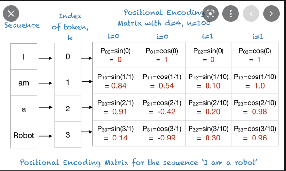

# Fall Detection App [](https://github.com/TalhaUsuf/transformer_pose/actions/workflows/fall_detection.yml)
This app uses a transformer based model (original implementation 2017 paper) to take `128D` pose vector at its input
and output a score regarding whether the person is falling or not.

The model is trained on a dataset of 1000 videos. Dummy dataset has been created in the form of a **csv** file
# Positional Encoding Understanding 🕸
> PE layer needs input to be `[Batch, Seq_len, Embedding_dim]` and output is `[Batch, Seq_len, Embedding_dim]`



[this](https://github.com/TalhaUsuf/multidim-positional-encoding.git) awesome 🔥 package has been
used for using the positional encodings.
install it using:

```bash
pip install positional-encodings[pytorch,tensorflow]
```


plot of positional encoding is shown:


# Transformer model 🛠
for understanding the pytorch transformer masks, see below link
```html
https://discuss.pytorch.org/t/understanding-mask-size-in-transformer-example/147655/2
```
transformer model uses **2** types of masks 🚀
 - zero padding mask
 - look ahead mask
the link above will help you understand the masks in transformer model

> as for this model neither of the masks are used, but you can use them if sequence lengths of videos are different
> this implementation also only uses the **encoder** part of the transformer model since sequence based decoder is not needed for this task
